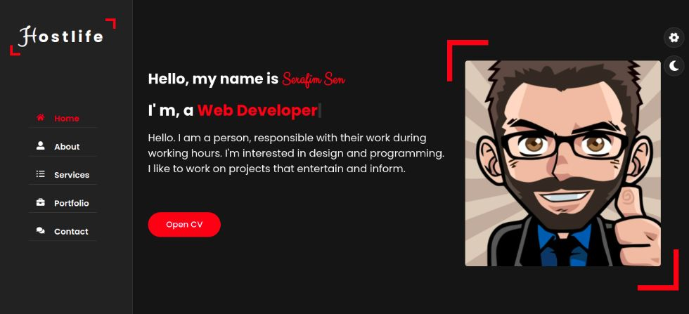

# Portfolio

### [Site link](https://precious-malasada-e9ce53.netlify.app/)

<kbd>
  
</kbd>

### 🛠 The tech stack is:

- [React](https://reactjs.org/)
- [TypeScript](https://www.typescriptlang.org/)
- [Redux-toolkit](https://redux-toolkit.js.org/)
- [React-router-dom](https://reactrouter.com/docs/en/v6/getting-started/overview)
- [framer-motion](https://www.framer.com/motion/)
- [React-lazy-load-image-component](https://github.com/Aljullu/react-lazy-load-image-component)
- [html2pdf.js](https://github.com/eKoopmans/html2pdf.js)
- [react-typed](https://www.npmjs.com/package/react-typed)
- [CSS3](https://en.wikipedia.org/wiki/Cascading_Style_Sheets)
- [Flexbox](https://en.wikipedia.org/wiki/CSS_Flexible_Box_Layout)
